# Disassembling-Epson-Stylus-SX-125

## Session 1

Found it in the trash, someone broke the glass from the scanner while it was on there waiting for some handy person

I never thught glass were so sharp until i cut myself when a glass smaller than 1.5mm fell on my thumb, didn't wore any gloves during this first session but i should had to.

As mosquitos would eat me alive I lit this

The printer had ink in it, so had to removet it

Opened the lid...

and grabbed them

The printer was full of glass

but finally got to get it out of iths core

## Session 2

today I actually got some parts

started by putting the mosquito thing

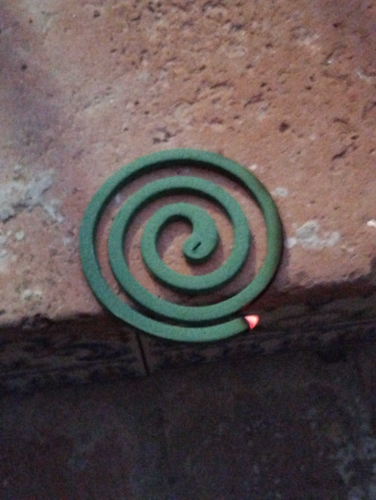

Then aimed for this stepper motor

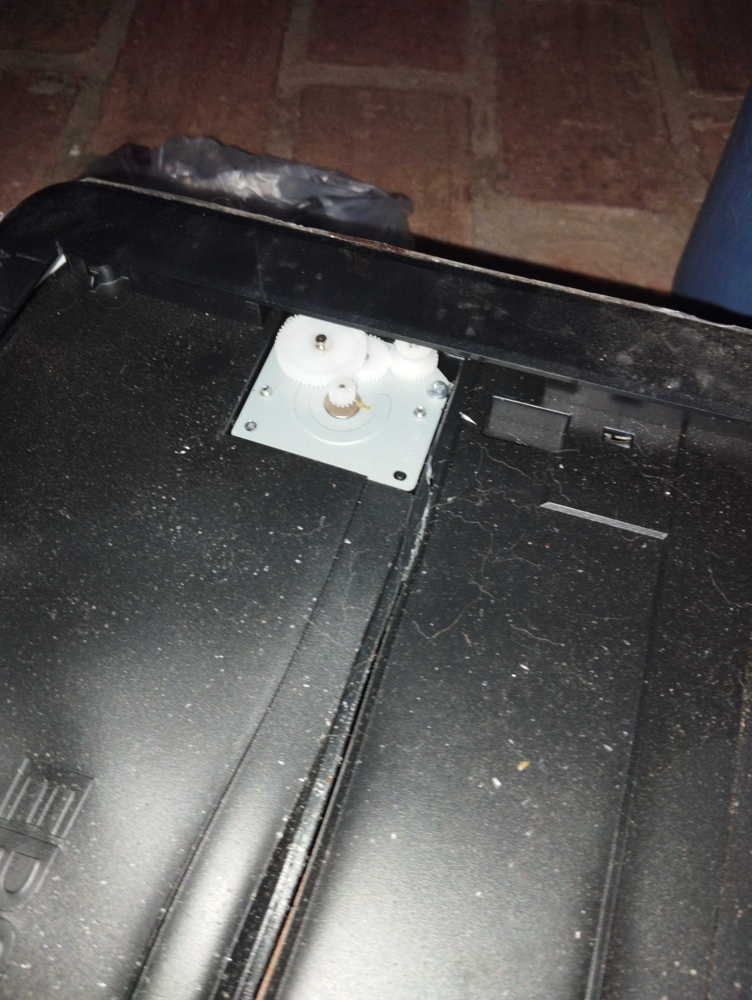

And found some glass on my way, later I cleaned it, for my future self i'll use gloves

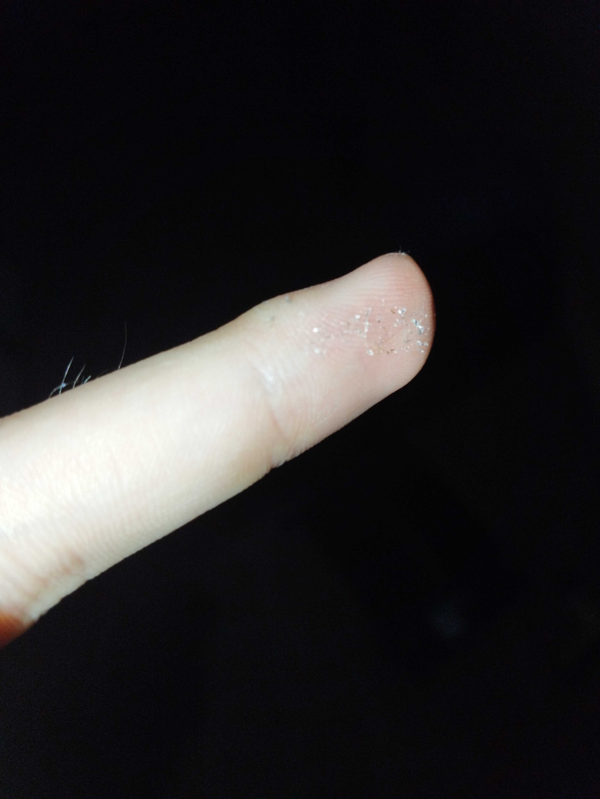

got the lid oppened

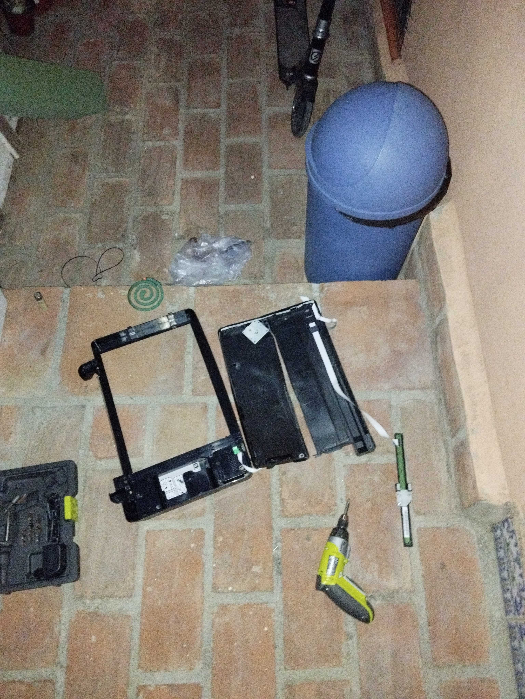

and got some parts finally, buttons, the light thing and the motor, the light could be used for a 3d printer

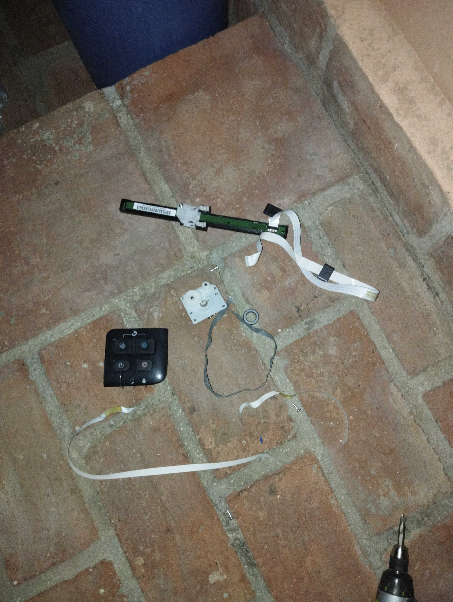

then I got a power supply and a motor

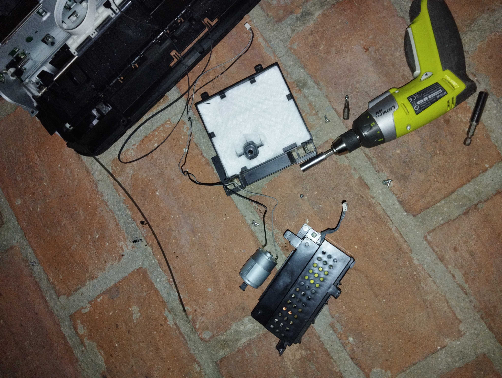

and another motor its pcb and an encoder thing

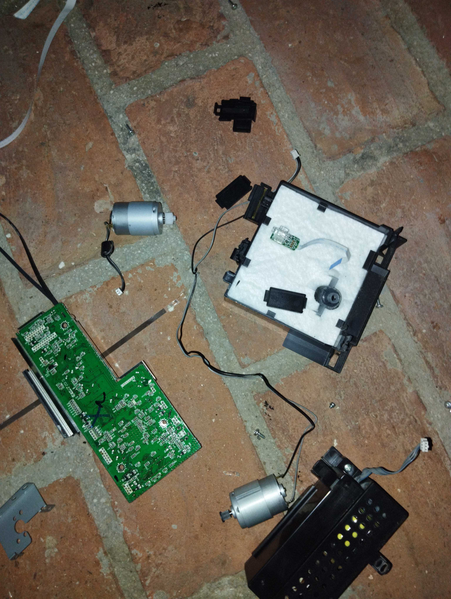

Theres no more pieces to get from this printer, so I'll throw the chassis to the trash

# Disassembling Epson XP-335

Found two more printers in the trash but they were in a better state than the previous one, the first one was an Epson XP-335, it was missing the cables and the ink catridges were leaking, so it had to be cleaned and tested to see if it worked

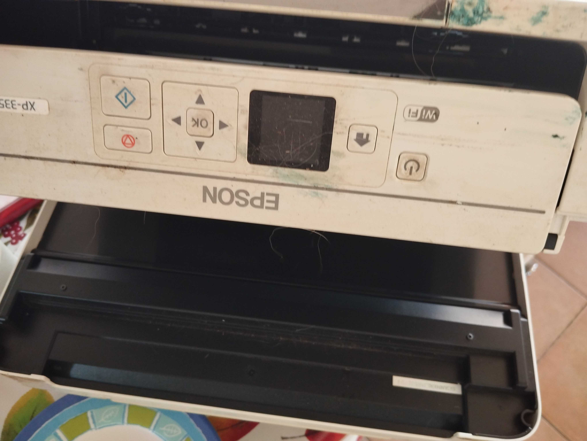

cleaned it, doesn't look like new but it's better

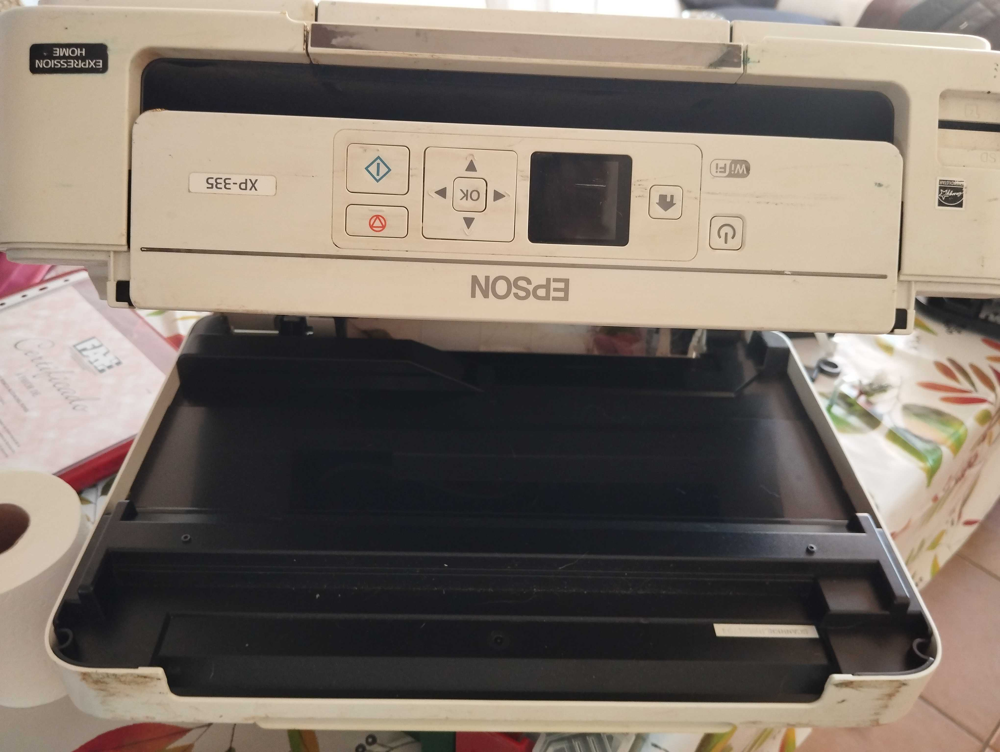

the paper feeder was full of leaves

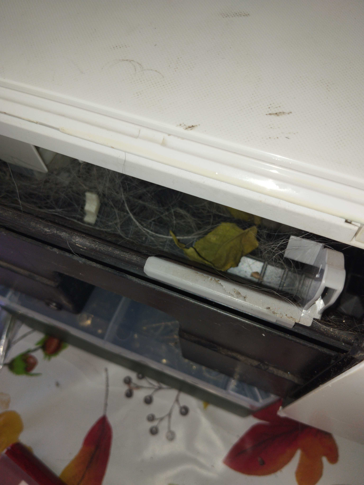

Searched a cable for it, found one

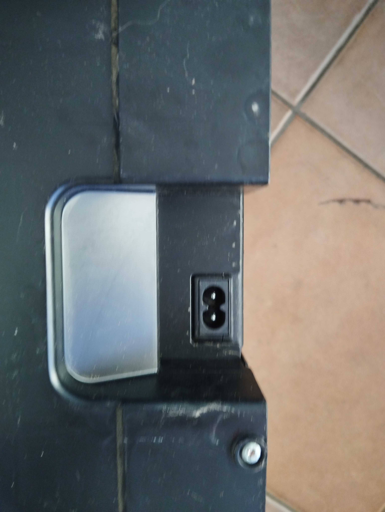

Replace the ink catridges, they didn't fit

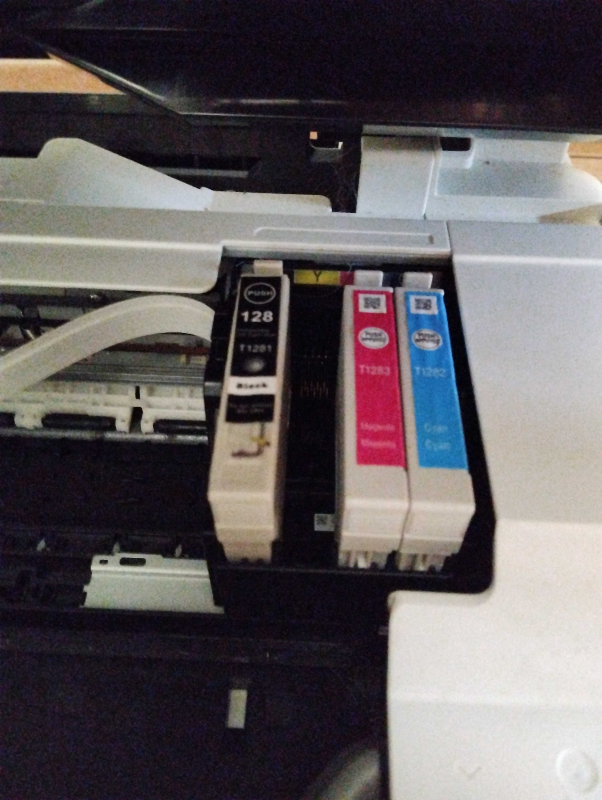

As a conclussion the printer was dumped because it was leaking ink and the ink catridges were not original, so it was impossible to know if it worked, I wont be dissasembling this printer until I get some new ink catridges to test it