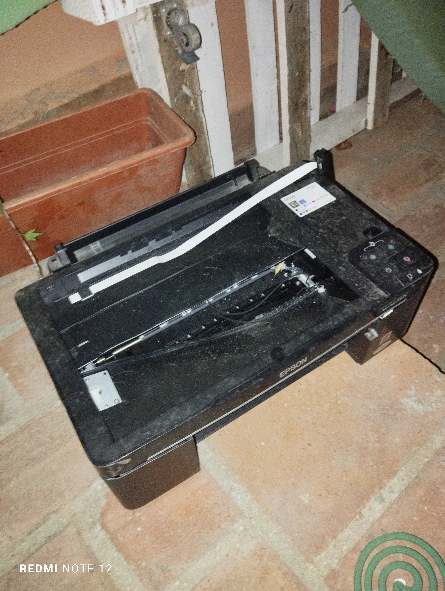
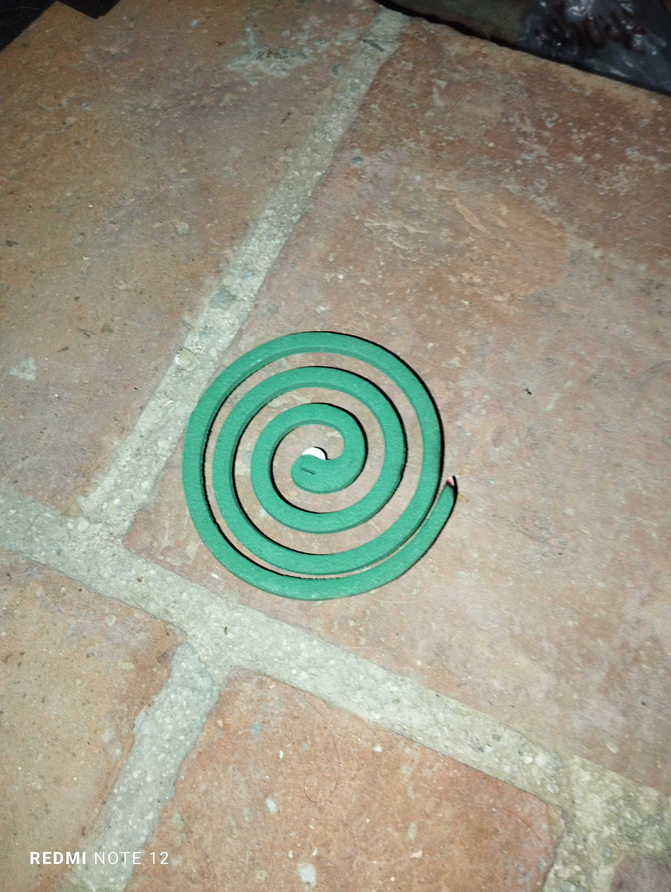
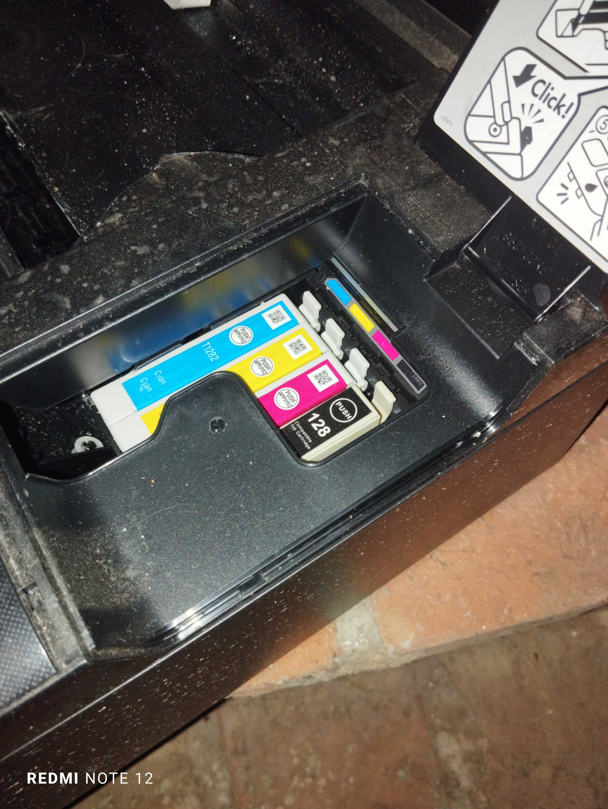
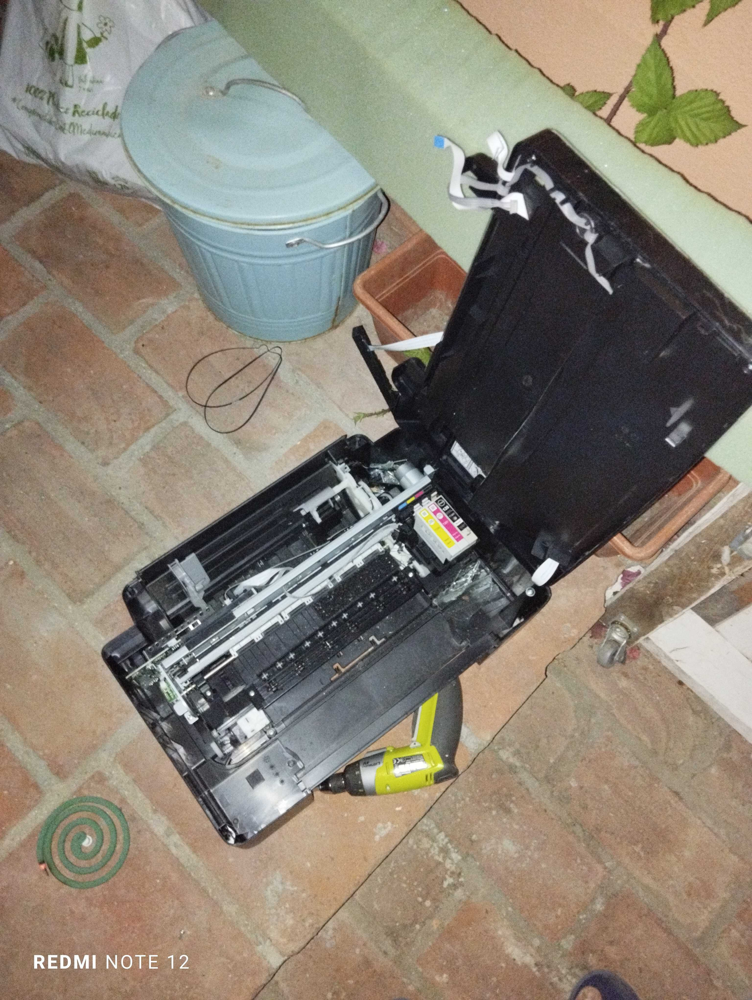
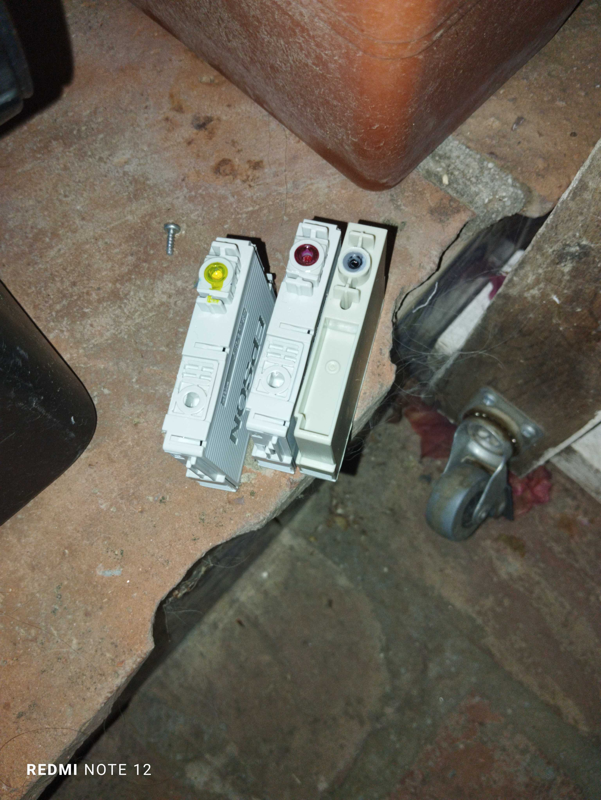
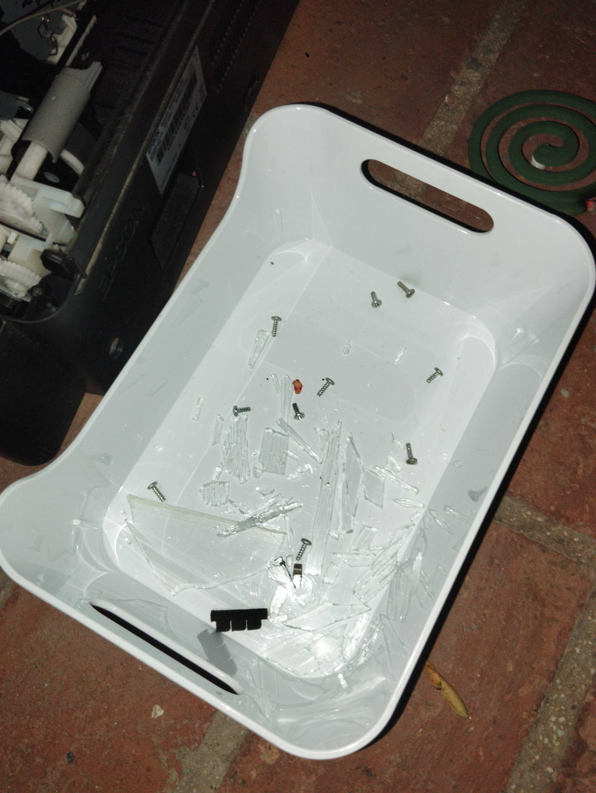
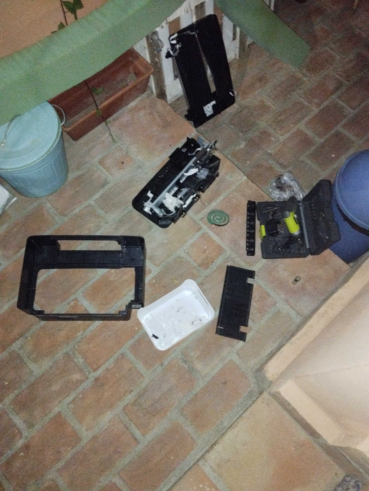

# Disassembling-Epson-Stylus-SX-125

## Session 1

Found it in the trash, someone broke the glass from the scanner while it was on there waiting for some handy person

I never thught glass were so sharp until i cut myself when a glass smaller than 1.5mm fell on my thumb, didn't wore any gloves during this first session but i should had to.

As mosquitos would eat me alive I lit this

The printer had ink in it, so had to removet it

Opened the lid...

and grabbed them

The printer was full of glass

but finally got to get it out of iths core

